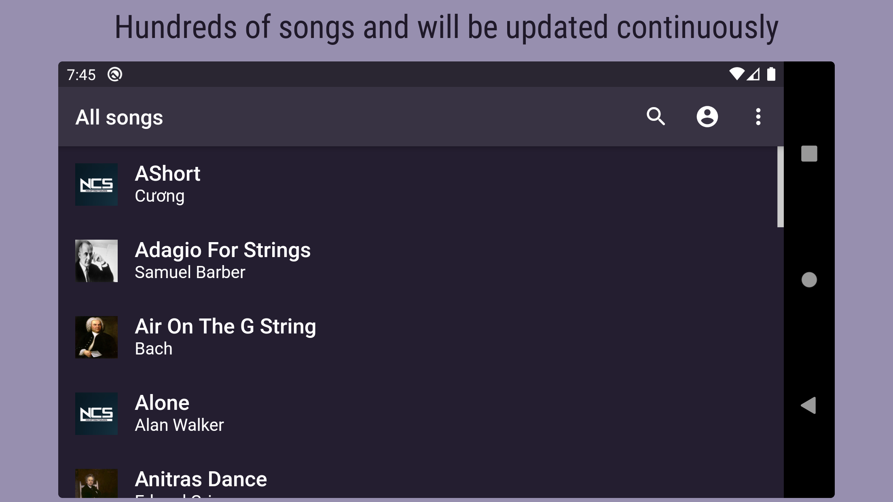
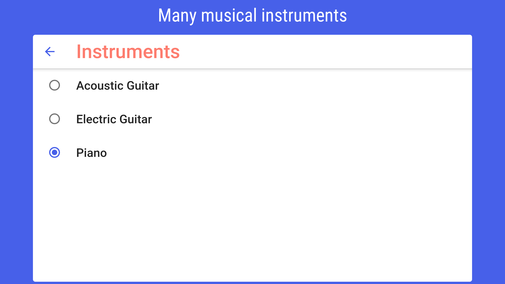
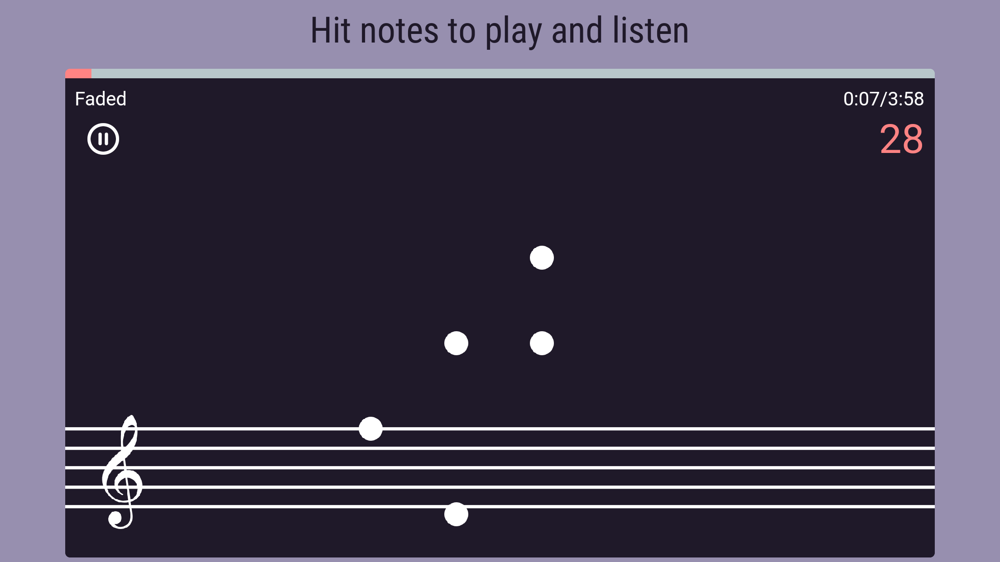

# Hit Notes - Play instruments


Rhythm-based mobile game. Even you don't have any basic knowledge of music instruments, you still can play with falling notes in the game! ✨

# Main Features

- Hundreds of songs, from classics of Beethoven, Chopin, Mozart, or Schubert, folk songs to POP/EDM. Will be updated continuously
- Adjustable difficulty level
- Adjustable tempo
- Many game modes
- Many musical instruments
- Play offline without the internet
- Upload your song and play your way





# Project Structure

This is a Flutter mobile game targeting Android and iOS.

The code for the Flutter app is contained in the folder `lib` and the
different native apps are in `android` and `ios`. Extra project assets are in
`assets`.

Firebase config files and cloud functions are inside the `firebase` folder.


# Prerequisites & Getting Started

## Client 

To build and run the mobile apps you’ll need to install [Flutter](https://flutter.dev) and its dependencies. To verify your installation run in the project’s root directory:**‌**

```
$ flutter doctor
```

## Backend (Firebase)

The backend is build using Firebase’s `node.js` SDK. All files are provided in the `firebase` folder. To deploy the code create an app and install the firebase CLI (See steps 1 & 2 in [Getting started](https://firebase.google.com/docs/functions/get-started)).

### B1. Setup sign-in method
An initial sign-in method needs to be configured.

- Select your project in [console.firebase.google.com](https://console.firebase.google.com). 
- Navigate to `Authentication` 
- Select `Sign-in methods` and activate `Google`, `Facebook` and `Anonymous`.

### B2. Configure firebase app

Next, you’ll need to configure your firebase app for Flutter as described in [Add Firebase to an App / Flutter](https://firebase.google.com/docs/flutter/setup)

**Android**

Follow the instructions in `android/README.md`.

# Deployment

The app is setup to work with a development and production environment. We suggest you create a different Firebase app for each environment. 

When building for release the app will automatically use the production configuration that you’ve configured in step `B2`.
