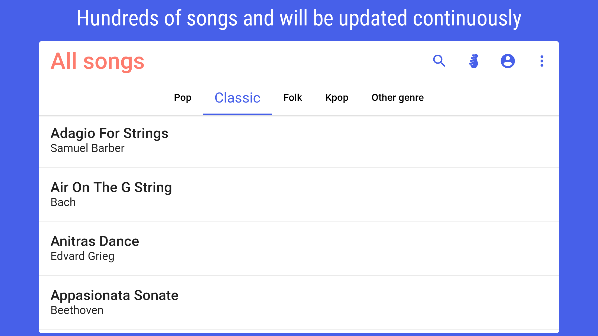
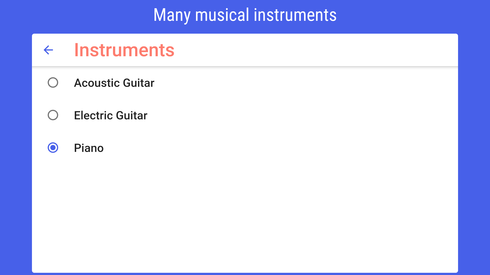
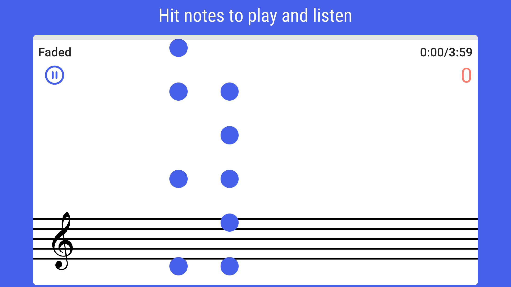

# Hit Notes - Play instruments

[](https://github.com/cuong0993/HitNotes/actions/workflows/build.yml)

Rhythm-based mobile game. Even you don't have any basic knowledge of music instruments, you still can play with falling notes in the game! ✨

Currently available on the Play store.

<a href='https://play.google.com/store/apps/details?id=com.chaomao.hittick'></a>

# Main Features

- Hundreds of songs, from classics of Beethoven, Chopin, Mozart, or Schubert, folk songs to POP/EDM. Will be updated continuously
- Adjustable difficulty level
- Adjustable tempo
- Many game modes
- Many musical instruments
- Play offline without the internet
- Upload your song and play your way





# Project Structure

This is a Flutter mobile game targeting Android and iOS.

The code for the Flutter app is contained in the folder `lib` and the
different native apps are in `android` and `ios`.

Extra project assets are in `assets`.

Firebase config files and cloud functions are in the `functions` folder.

# Prerequisites & Getting Started

## Client 

To build and run the mobile apps you’ll need to install [Flutter](https://flutter.dev) and its dependencies. To verify your installation run in the project’s root directory:**‌**

```
$ flutter doctor
```

## Backend (Firebase)

### B1. Setup sign-in method
An initial sign-in method needs to be configured.

- Select your project in [console.firebase.google.com](https://console.firebase.google.com). 
- Navigate to `Authentication` 
- Select `Sign-in methods` and activate `Google`, `Facebook` and `Anonymous`.

### B2. Configure firebase app

Next, you’ll need to configure your firebase app for Flutter as described in [Add Firebase to an App / Flutter](https://firebase.google.com/docs/flutter/setup)

**Android**

Follow the instructions in `android/README.md`.

### B3. Deploy functions and synchronize storage

Install Google Cloud SDK and run:

```
$ ./synchronize_backend.sh projectId
```

### B4. Synchronize database 

Install https://github.com/jloosli/node-firestore-import-export, get service account json file https://firebase.google.com/docs/admin/setup#initialize-sdk, navigate to the `database` directory, backup/restore database using:

```
$ export GOOGLE_APPLICATION_CREDENTIALS="service-account.json"; ./backup-firestore.sh
$ export GOOGLE_APPLICATION_CREDENTIALS="service-account.json"; ./restore-firestore.sh
```
